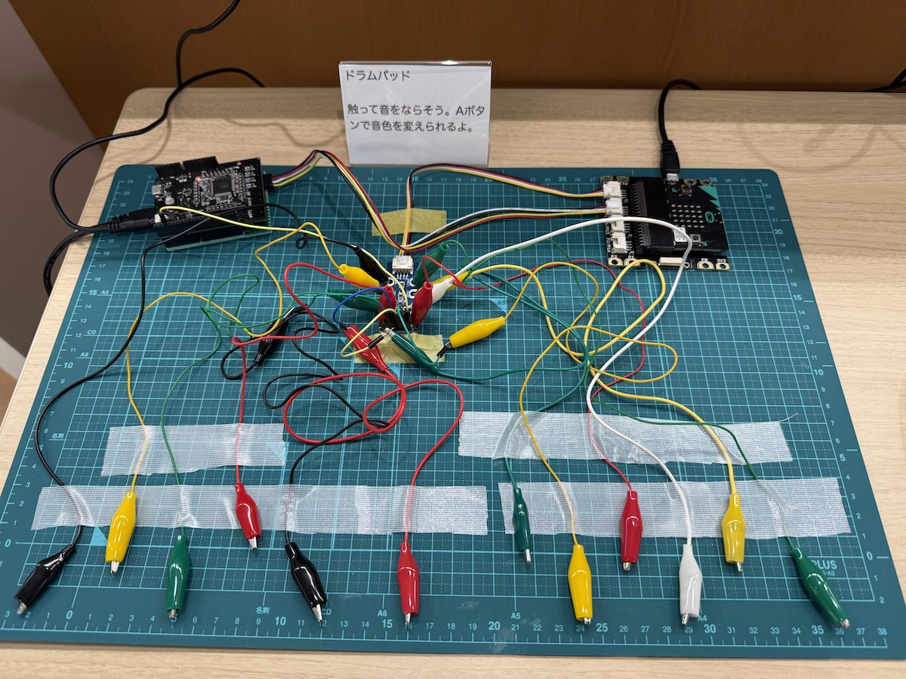

# drum-pad-microbit
Drum Pad demo for micro:bit

## 説明
タッチセンサーとMIDI音源を使用したドラムパッドです。

## 使用した機材
* micro:bit v1.5（MIDIの通信ボーレートが特殊なので、v2では動作しません） ...おそらく、[これ](https://github.com/lancaster-university/codal-microbit-v2/issues/285)が解決すればv2でも動作します。
* Seeed micro:bit用GROVEシールド v2.0
* Seeed 12 key capacitive I2C touch sensor V3
* eVY1シールド

## デバイスとの接続

micro:bitと他の部品は以下のように接続してください。

|micro:bit|I2C touch sensor|eVY1シールド|
|---|---|---|
|P19 (SCL)|SCL||
|P20 (SDA)|SDA||
|P0||IO1/TXD (D1)|
|P14|INT||
|3V3 (VDD)|3V3|3V3|
|GND|GND|GND|

## 使用方法

micro:bitの[Python開発ページ](https://python.microbit.org/v/3)にアクセスして、`開く...`ボタンをタップして、main.pyを選択します。`micro:bitに送る`ボタンをタップして、プログラムを書き込みます。

